### 1. `std::async` - **最高级抽象**
#### 核心特点：
- **自动管理线程**：自动创建线程执行任务（取决于启动策略）
- **直接返回 future**：一步到位获取结果容器
- **最简单的使用方式**：隐藏了底层细节

```cpp
#include <future>
#include <iostream>

int compute() {
    // 耗时计算...
    return 42;
}

int main() {
    // 启动异步任务并获取 future
    auto fut = std::async(std::launch::async, compute);
    
    // 获取结果（阻塞直到完成）
    int result = fut.get();
    std::cout << "Result: " << result << std::endl;
}
```

#### 启动策略：
| 策略                   | 行为                             |
|------------------------|----------------------------------|
| `std::launch::async`   | 强制在新线程执行                 |
| `std::launch::deferred` | 延迟执行（调用 get() 时执行）    |
| 默认（无指定）         | 由实现决定                       |

---

### 2. `std::packaged_task` - **任务包装器**
#### 核心特点：
- **可调用对象包装器**：将函数/可调用对象与 promise 绑定
- **手动控制执行时机**：可在任意线程调用
- **可多次使用**（需要重新构造）

```cpp
#include <future>
#include <thread>
#include <iostream>

int main() {
    // 包装任务（未执行）
    std::packaged_task<int()> task([]{ return 7 * 6; });
    
    // 获取关联的 future
    std::future<int> fut = task.get_future();
    
    // 在独立线程执行任务
    std::thread t(std::move(task));
    t.detach();  // 或 t.join()
    
    // 获取结果
    std::cout << "6*7 = " << fut.get() << std::endl;
}
```

#### 典型使用场景：
- 线程池任务队列
- 延迟执行控制
- 需要重复使用任务模板

---

### 3. `std::promise` - **最低级控制**
#### 核心特点：
- **显式值设置**：手动设置结果值或异常
- **完全控制权**：可在任意位置设置结果
- **跨线程通信**：解耦结果生产者和消费者

```cpp
#include <future>
#include <thread>
#include <iostream>

void worker(std::promise<int> result_promise) {
    try {
        // 执行计算...
        result_promise.set_value(42);  // 显式设置结果
    } catch(...) {
        // 捕获异常并传递
        result_promise.set_exception(std::current_exception());
    }
}

int main() {
    std::promise<int> prom;
    std::future<int> fut = prom.get_future();
    
    // 传递 promise 给工作线程
    std::thread t(worker, std::move(prom));
    
    // 获取结果
    std::cout << "Result: " << fut.get() << std::endl;
    t.join();
}
```

#### 关键能力：
- 分离结果设置点（可在不同函数/线程设置结果）
- 支持设置异常：`set_exception()`
- 可创建 void 特化版（无返回值的事件通知）

---

### 三者的核心区别对比
| 特性                     | `std::async`               | `std::packaged_task`       | `std::promise`             |
|--------------------------|----------------------------|----------------------------|----------------------------|
| **抽象层级**             | 高级（全自动）             | 中级（半自动）             | 低级（手动控制）           |
| **线程管理**             | 自动创建线程               | 需手动启动                 | 完全手动控制               |
| **结果设置方式**         | 自动（函数返回值）         | 自动（调用任务时）         | 手动调用 `set_value()`     |
| **任务执行控制**         | 有限（通过启动策略）       | 完全控制（何时调用任务）   | 完全控制（何时设置结果）   |
| **异常传递**             | 自动捕获                   | 自动捕获                   | 需手动 `set_exception()`   |
| **适用场景**             | 简单异步任务               | 任务队列/线程池            | 复杂同步/跨模块通信        |
| **可重用性**             | ❌（单次使用）              | ✅（需重建）                | ✅（但需谨慎）              |
| **结果生产者-消费者关系**| 1:1                        | 1:1                        | 1:1 或 1:N（通过共享 future）|

---

### 生命周期对比

```mermaid
graph TD
    subgraph async
    A[创建 async] --> B[自动启动线程]
    B --> C[自动设置结果到 future]
    end

    subgraph packaged_task
    D[创建 packaged_task] --> E[手动传递/存储]
    E --> F[调用任务时设置结果]
    end

    subgraph promise
    G[创建 promise] --> H[获取关联 future]
    H --> I[任意位置手动设置结果]
    end
```


---

### 如何选择？
1. **首选 `std::async`**  
   当需要简单执行异步任务，不关心线程管理细节时

2. **选择 `std::packaged_task`**  
   当需要：
   - 将任务放入队列
   - 控制任务执行时机
   - 重用任务模板

3. **选择 `std::promise`**  
   当需要：
   - 在非直接关联的代码位置设置结果
   - 实现复杂同步机制
   - 跨模块/组件通信
   - 手动控制异常传递

> 💡 **黄金法则**：优先使用高层抽象（async），当需要更精细控制时降级使用（packaged_task → promise）

---

### 组合使用示例
三者可协同工作：
```cpp
// 使用 promise 控制复杂流程
std::promise<void> ready_promise;

// 用 packaged_task 包装任务
std::packaged_task<void()> task([&] {
    ready_promise.set_value();  // 通知准备就绪
    // ... 执行任务 ...
});

auto fut = ready_promise.get_future();
std::thread t(std::move(task));

// 用 async 等待准备信号
auto async_fut = std::async(std::launch::async, [&] {
    fut.wait();  // 等待就绪信号
    // ... 后续处理 ...
});

t.join();
async_fut.get();
```

这种组合提供了最大灵活性，同时保持了代码的清晰性。