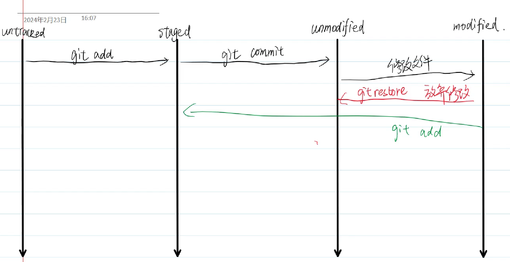

以下是对这些常见 Git 命令及合并分支情况的详细解释：

### 1. `git log --oneline --graph --all`
- **功能**：以简洁的方式展示所有分支的提交历史，并以图形化的形式呈现分支之间的关系。
- **参数解释**：
    - `--oneline`：将每个提交信息压缩为一行显示，通常只显示提交的哈希值前几位和提交说明。
    - `--graph`：以图形化的方式展示分支的合并情况，用 ASCII 字符绘制出分支的分叉和合并路径。
    - `--all`：显示所有分支的提交历史，而不仅仅是当前分支。

### 2. `git status`
- **功能**：查看当前工作目录和暂存区的状态。它会显示哪些文件被修改了、哪些文件被添加到了暂存区、哪些文件是未跟踪的等信息。通过该命令，你可以了解当前仓库的状态，以便决定下一步的操作，比如是否要将修改添加到暂存区、是否要提交等。

### 3. `git restore --staged <file>`
- **功能**：将指定文件从暂存区移除，但不改变工作区中该文件的内容。当你使用 `git add` 命令将文件添加到暂存区后，又不想将这些修改提交时，可以使用该命令撤销 `git add` 的操作。例如，若执行了 `git add example.txt`，之后想取消该文件的暂存状态，就可以运行 `git restore --staged example.txt`。

### 4. `git restore`
- **功能**：恢复工作区或暂存区的文件。
    - **恢复工作区文件**：当不带 `--staged` 选项时，`git restore <file>` 会丢弃工作区中指定文件的修改，将其恢复到上一次提交时的状态。例如，`git restore example.txt` 会让 `example.txt` 文件回到上次提交时的样子。
    - **结合 `--source` 选项**：可以指定从某个提交版本恢复文件，如 `git restore --source=abc123 example.txt` 会将 `example.txt` 恢复到提交 `abc123` 时的状态。

### 5. `git branch fix_bug; git checkout fix_bug; git branch -D fix_bug`
#### `git branch fix_bug`
- **功能**：创建一个名为 `fix_bug` 的新分支。分支是 Git 中非常重要的概念，它允许你在不影响主分支的情况下进行独立的开发工作，比如修复 bug 或者开发新功能。
#### `git checkout fix_bug`
- **功能**：切换到 `fix_bug` 分支。执行该命令后，你的工作目录会基于 `fix_bug` 分支的最新提交进行更新，之后的修改都会记录在该分支上。
#### `git branch -D fix_bug`
- **功能**：强制删除 `fix_bug` 分支。`-D` 选项表示强制删除，即使该分支上有未合并的提交也会被删除。如果使用 `-d` 选项，则只有在该分支上的所有提交都已经合并到其他分支时才会被删除。

### 6. 合并分支的情况（`git checkout active; git merge passive; git branch -D passive`）
#### `git checkout active`
- **功能**：切换到 `active` 分支。`active` 通常是目标分支，即你想要将其他分支的修改合并进来的分支。例如，在开发中，`active` 可能是 `main` 或 `master` 分支。
#### `git merge passive`
- **功能**：将 `passive` 分支的修改合并到当前所在的 `active` 分支。合并操作会尝试将 `passive` 分支上的所有提交应用到 `active` 分支上。如果在两个分支上对同一文件的同一部分进行了不同的修改，可能会出现合并冲突，需要手动解决。
#### `git branch -D passive`
- **功能**：在合并完成后，强制删除 `passive` 分支。因为 `passive` 分支上的修改已经合并到了 `active` 分支，所以可以安全地删除该分支，以保持仓库的整洁。

### 快进合并（Fast - forward merge）
在上述合并操作中，如果 `passive` 分支是基于 `active` 分支创建的，并且在创建之后 `active` 分支没有新的提交，那么合并操作会采用快进合并的方式。快进合并不会创建新的提交记录，只是将 `active` 分支的指针直接移动到 `passive` 分支的最新提交处，就好像 `active` 分支“快进”到了 `passive` 分支的位置。这种合并方式非常简洁高效。 
