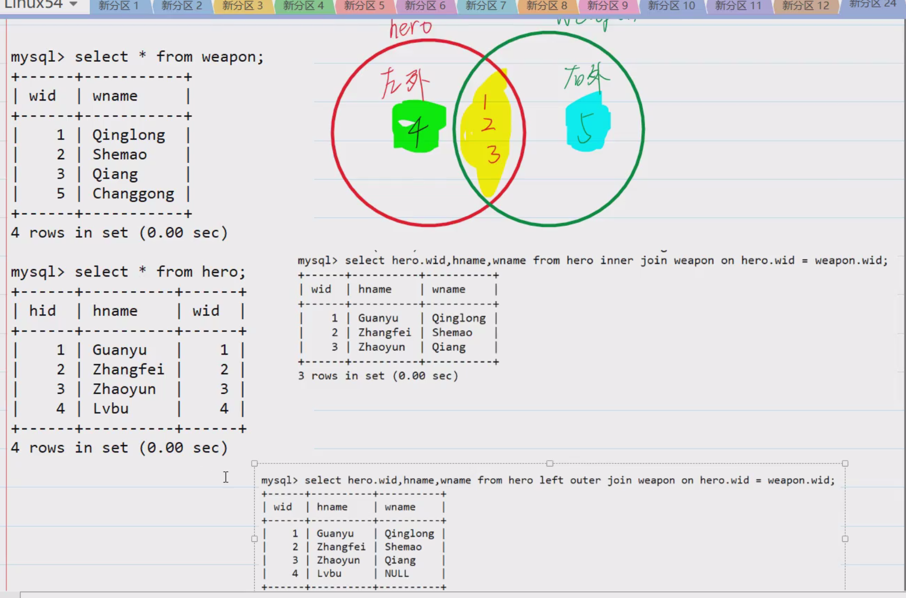

在 MySQL 里，内连接（`INNER JOIN`）是一种常用的连接类型，它用于从多个表中选取满足连接条件的记录。内连接只会返回那些在连接的表中匹配成功的行。下面为你详细介绍内连接的概念、语法和示例。

### 基本概念
内连接的核心思想是基于两个或多个表之间的共同列，找出这些表中该列值相等的行，并将这些行组合起来形成查询结果。例如，有两个表：`orders` 表和 `customers` 表，`orders` 表中有 `customer_id` 列，`customers` 表中有 `id` 列，通过内连接可以将 `orders` 表和 `customers` 表中 `customer_id` 和 `id` 值相等的行连接起来，从而获取订单和对应的客户信息。

### 语法
内连接的基本语法如下：
```sql
SELECT column1, column2, ...
FROM table1
INNER JOIN table2
ON table1.column_name = table2.column_name;
```
- `column1, column2, ...`：你要查询的列名，可以来自 `table1` 或 `table2`。
- `table1` 和 `table2`：你要连接的表名。
- `INNER JOIN`：指定连接类型为内连接。
- `ON`：指定连接条件，通常是两个表中相关列的相等条件。

### 示例
假设现在有两个表：`pet_owners` 表和 `pet` 表，`pet_owners` 表存储宠物主人的信息，`pet` 表存储宠物的信息，两个表通过 `owner_id` 列关联。

#### 表结构和数据示例
```sql
-- 创建 pet_owners 表
CREATE TABLE pet_owners (
    owner_id INT PRIMARY KEY,
    owner_name VARCHAR(50)
);

-- 插入 pet_owners 表数据
INSERT INTO pet_owners (owner_id, owner_name) VALUES
(1, 'Alice'),
(2, 'Bob'),
(3, 'Charlie');

-- 创建 pet 表
CREATE TABLE pet (
    pet_id INT PRIMARY KEY,
    pet_name VARCHAR(50),
    owner_id INT,
    FOREIGN KEY (owner_id) REFERENCES pet_owners(owner_id)
);

-- 插入 pet 表数据
INSERT INTO pet (pet_id, pet_name, owner_id) VALUES
(1, 'Tom', 1),
(2, 'Jerry', 2),
(3, 'Lucy', 1);
```

#### 内连接查询示例
```sql
SELECT pet.pet_name, pet_owners.owner_name
FROM pet
INNER JOIN pet_owners
ON pet.owner_id = pet_owners.owner_id;
```
**解释**：
- 此查询从 `pet` 表和 `pet_owners` 表中选取数据。
- `INNER JOIN` 关键字指定使用内连接。
- `ON pet.owner_id = pet_owners.owner_id` 是连接条件，确保只返回 `pet` 表和 `pet_owners` 表中 `owner_id` 相等的行。
- 查询结果会包含每只宠物的名字和其主人的名字。

### 多表内连接
内连接也可以用于多个表的连接，语法如下：
```sql
SELECT column1, column2, ...
FROM table1
INNER JOIN table2
ON table1.column_name = table2.column_name
INNER JOIN table3
ON table2.column_name = table3.column_name;
```
多表内连接的原理和两表内连接相同，只是依次连接多个表，根据连接条件筛选出匹配的行。

### 注意事项
- **连接条件的重要性**：内连接依赖于连接条件来匹配行，所以确保连接条件正确非常重要，否则可能会得到错误的结果。
- **性能考虑**：在处理大量数据时，内连接可能会影响查询性能。可以通过创建适当的索引来优化连接操作。 
